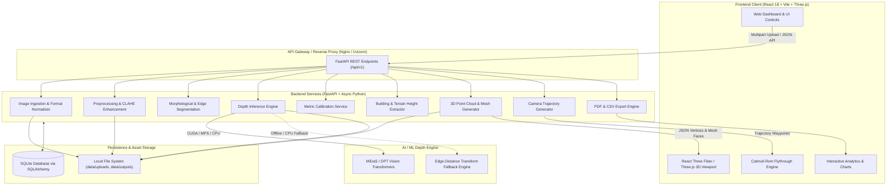

<div align="center">

# 🧙‍♂️ DepthWizard

### Monocular 2D Aerial & Satellite to 3D Digital Elevation & Height Analytics Engine

[](https://www.python.org/)
[](https://fastapi.tiangolo.com/)
[](https://reactjs.org/)
[](https://threejs.org/)
[](https://pytorch.org/)
[](https://sih.gov.in/)
[](LICENSE)

**Smart India Hackathon (SIH) 2026 | Problem Statement ID: 26175**  
*Next-Generation 3D Terrain & Building Reconstruction from Single Monocular Satellite/Aerial Imagery*

</div>

---

## 📌 Problem Statement (SIH 2026: PS-26175)

Traditional photogrammetry and stereo-vision systems demand multiple overlapping multi-view stereo passes, costly aerial LiDAR surveys, or synchronized drone flight arrays. Such operations require prohibitive bandwidth, high acquisition costs, and extensive survey time.

**DepthWizard** solves this critical operational bottleneck by converting **a single 2D aerial or satellite image** (RGB or Grayscale) into an accurate, interactive **3D Digital Elevation Model (DEM)**, estimating building and terrain heights, generating dense point clouds, textured meshes, and cinematic orbital flythroughs with zero hardware overhead.

---

## 🚀 Key Features

- **🌐 Single-Image Monocular Depth Estimation**: Utilizes state-of-the-art vision transformer and convolutional models (MiDaS / DPT) with an automatic offline multi-scale gradient heuristic fallback.
- **🏙️ Semantic Structure & Building Height Estimation**: Computes localized ground-to-roof relative elevation deltas with automated building contour extraction and confidence scoring.
- **📐 Metric Scale Calibration**: Flexible scale factors using reference building height, drone altitude, sensor focal length, or Ground Sampling Distance (GSD).
- **🧊 Interactive 3D Web Visualization**: Real-time rendering via Three.js and React Three Fiber supporting orbit controls, dynamic height color gradients (Viridis, Magma, Turbo), wireframe overlays, and point clouds.
- **✈️ Cinematic 3D Flythrough Animations**: Parametric camera trajectory generation using Centripetal Catmull-Rom splines with play, pause, seek, and loop controls.
- **📊 Comprehensive Analytics & Export**: Generates PDF, CSV, and JSON inspection reports including elevation distributions, building inventories, and volumetric metrics.
- **⚡ Instant Demo Mode**: One-click end-to-end processing demonstration with pre-baked high-resolution aerial datasets.

---

## 🏗️ System Architecture



---

## 🛠️ Technology Stack

| Layer | Technologies |
|---|---|
| **Frontend UI** | React 18, TypeScript, Vite, Tailwind CSS, Lucide Icons |
| **3D Rendering** | Three.js, React Three Fiber (`@react-three/fiber`), Drei (`@react-three/drei`) |
| **Backend API** | Python 3.11, FastAPI, Uvicorn, Pydantic v2, Python-Multipart |
| **ML & Computer Vision** | PyTorch, Torchvision, MiDaS / DPT, OpenCV (`opencv-python-headless`), NumPy, SciPy |
| **Data Persistence** | SQLite with SQLAlchemy 2.0 (AsyncIO / aiosqlite) |
| **Reporting & Export** | ReportLab (PDF), Python standard CSV & JSON |
| **DevOps & Containers** | Docker, Docker Compose, Nginx Alpine |

---

## 💻 Installation & Quickstart

### Prerequisites
- **Python**: 3.10 or higher
- **Node.js**: 18.0.0 or higher (with `npm`)
- **Git**

---

### Step 1: Clone Repository
```bash
git clone https://github.com/your-org/depthwizard.git
cd depthwizard
```

### Step 2: Configure Environment
Copy the sample environment variables:
```bash
# Windows (PowerShell)
Copy-Item .env.example .env

# Linux / macOS
cp .env.example .env
```

---

### Step 3: Backend Setup

1. Open a terminal in the root directory:
```bash
cd backend
```

2. Create and activate a virtual environment:
```bash
# Windows
python -m venv venv
.\venv\Scripts\activate

# Linux / macOS
python3 -m venv venv
source venv/bin/activate
```

3. Install Python dependencies:
```bash
pip install --upgrade pip
pip install -r requirements.txt
```

4. Initialize the SQLite database:
```bash
python init_db.py
```

5. Start the FastAPI backend:
```bash
uvicorn app.main:app --reload --host 0.0.0.0 --port 8000
```
> The API will be accessible at: `http://localhost:8000`  
> Interactive OpenAPI documentation: `http://localhost:8000/docs`

---

### Step 4: AI Model Download (Optional but Recommended)

In a new terminal (with the virtual environment activated), run:
```bash
python scripts/download_models.py
```
> **Note**: If you do not download the neural weights, DepthWizard automatically activates its built-in computer vision heuristic depth engine, ensuring full offline functionality.

---

### Step 5: Frontend Setup

1. Open a new terminal in the `frontend` directory:
```bash
cd frontend
npm install
npm run dev
```

2. Open your browser and navigate to:
```
http://localhost:5173
```

---

## 🐳 Docker Deployment

To launch the full stack (FastAPI backend + React frontend + Nginx proxy) via Docker Compose:

```bash
# Build and run containers in detached mode
docker-compose up --build -d

# Verify running services
docker-compose ps

# View logs
docker-compose logs -f
```

- Web Interface: `http://localhost:5173`
- Backend API Direct: `http://localhost:8000`

---

## 🎯 Demo Mode Instructions

DepthWizard comes with a fully automated **Demo Mode** for zero-setup evaluations and SIH jury presentations:

1. Launch the frontend and navigate to the **Landing Page** (`/`).
2. Click the **"Launch Live Demo"** button on the hero banner.
3. DepthWizard will automatically:
   - Instantiate a pre-calibrated aerial project (`Demo Project`).
   - Load high-resolution multi-building aerial imagery.
   - Run preprocessing, edge segmentation, and depth inference.
   - Calculate scale-calibrated building heights.
   - Generate point cloud and 3D surface mesh representations.
   - Initialize the interactive 3D viewer and camera flythrough trajectory.

---

## 📖 API Documentation Summary

| Method | Endpoint | Description |
|---|---|---|
| `GET` | `/api/v1/health` | Service health status & ML model availability |
| `POST` | `/api/v1/projects/` | Create a new reconstruction project |
| `GET` | `/api/v1/projects/` | List all existing projects |
| `GET` | `/api/v1/projects/{id}` | Fetch project details and metadata |
| `POST` | `/api/v1/upload/` | Upload RGB or Grayscale aerial image (`multipart/form-data`) |
| `POST` | `/api/v1/preprocess` | Execute grayscale conversion, noise reduction & CLAHE |
| `POST` | `/api/v1/segment` | Segment image features (buildings, terrain, vegetation) |
| `POST` | `/api/v1/depth/estimate` | Compute monocular depth map via MiDaS or CV fallback |
| `POST` | `/api/v1/calibrate/` | Calibrate metric scale factor via reference or altitude |
| `POST` | `/api/v1/height/estimate` | Estimate building and terrain elevations in meters |
| `POST` | `/api/v1/reconstruct/pointcloud` | Generate 3D point cloud coordinate array |
| `POST` | `/api/v1/reconstruct/mesh` | Generate triangulated 3D polygonal surface mesh |
| `POST` | `/api/v1/flythrough/path` | Compute smooth Catmull-Rom 3D camera flightpath |
| `POST` | `/api/v1/flythrough/render` | Validate camera trajectory rendering pipeline |
| `GET` | `/api/v1/reports/{project_id}` | Retrieve comprehensive analytics JSON payload |
| `GET` | `/api/v1/reports/{project_id}/export/json`| Download project summary in JSON format |
| `GET` | `/api/v1/reports/{project_id}/export/csv` | Download building height tabular CSV |
| `GET` | `/api/v1/demo/` | Query demo configuration and sample assets |
| `POST` | `/api/v1/demo/run` | Execute automated end-to-end demo pipeline |

*See [`docs/api.md`](docs/api.md) for full endpoint specifications, request payloads, and response schemas.*

---

## 🖼️ User Interface & Workflow Previews

```
+-----------------------------------------------------------------------------+
|  DEPTHWIZARD v1.0   [Dashboard]  [Upload]  [3D Viewer]  [Analytics]  [Demo] |
+-----------------------------------------------------------------------------+
|                                                                             |
|   1. Monocular 2D Input       2. AI Depth Estimation     3. 3D Elevation    |
|   +--------------------+      +--------------------+     +----------------+ |
|   |                    |      |  ██████▒▒▒▒░░░░    |     |    ▲           | |
|   |     Aerial RGB     | ---> |    Depth Matrix    | --> |   /█\  3D MESH | |
|   |    Ortho-photo     |      |  (MiDaS / DPT)     |     |  /███\  VIEWER | |
|   +--------------------+      +--------------------+     +----------------+ |
|                                                                             |
|   4. Building Height Extraction           5. Cinematic Drone Flythrough     |
|   +------------------------------------+  +-------------------------------+ |
|   | Bld 1: 24.5 m | Max Elev:  42.1 m  |  | Cam Pos: [x, y, z]  [Play/||] | |
|   | Bld 2: 18.2 m | Mean Elev: 12.4 m  |  | Spline: Centripetal Catmull   | |
|   | Bld 3: 31.0 m | Confidence: 89%    |  | Duration: 10.0s  FPS: 30      | |
|   +------------------------------------+  +-------------------------------+ |
+-----------------------------------------------------------------------------+
```

---

## ⚠️ Limitations

- **Monocular Scale Ambiguity**: Single-view depth estimation is inherently scale-and-shift invariant. True metric accuracy requires reference calibration parameters (known building height, focal length, or flight altitude).
- **Extreme Shadows & Sun Angles**: Very steep shadows can occasionally bias local depth estimation towards greater depression depths.
- **Micro-Feature Resolution**: Thin vertical structures (e.g. transmission towers, thin antennas) may be smoothed during neural tensor downsampling.
- **CPU Inference Speed**: Neural transformer models execute in ~80-150ms on GPU, but may require 1.0-3.0s on standard multi-core CPUs (mitigated by the instant CV fallback mode).

*For a detailed analysis, consult [`docs/limitations.md`](docs/limitations.md).*

---

## 🔮 Future Roadmap

- [ ] **Multi-View Stereo (MVS) Fusion**: Support merging multiple overlapping drone passes when available.
- [ ] **3D Gaussian Splatting & NeRF Export**: Ultra-photorealistic novel-view synthesis from monocular inputs.
- [ ] **Segment Anything Model (SAM) Integration**: Zero-shot high-precision rooftop boundary extraction.
- [ ] **GIS Standards Integration**: Direct export to GeoTIFF (DEM/DSM), LAS/LAZ point clouds, and CityGML formats.
- [ ] **WebAssembly (WASM) / WebGPU Engine**: In-browser client-side tensor inference.

---

## 📄 License

This project is licensed under the **MIT License** - see the [LICENSE](LICENSE) file for details.

---

<div align="center">
  <b>Smart India Hackathon (SIH) 2026</b><br>
  Built with ❤️ by Team DepthWizard
</div>
