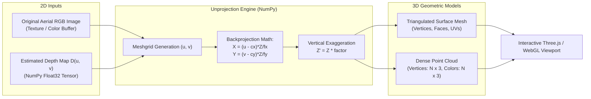
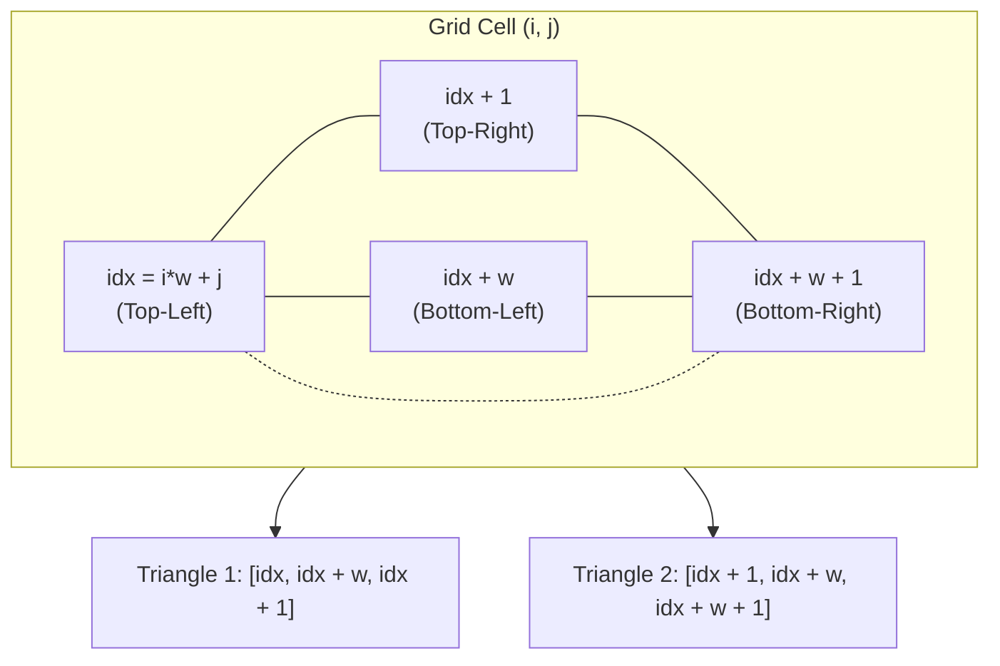
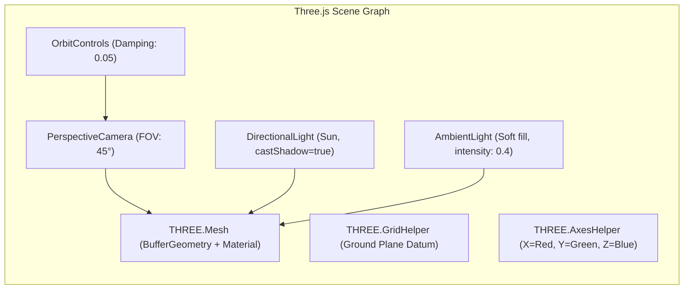

# 3D Digital Elevation Reconstruction: Point Clouds & Polygonal Meshes

## 1. Overview & 2D-to-3D Unprojection Mathematics

DepthWizard translates 2D raster depth matrices and aerial color images into interactive 3D digital elevation models (DEM) and digital surface models (DSM).

Given an input image of dimensions $(W, H)$, optical center $(c_x, c_y) = (W/2, H/2)$, focal lengths $(f_x, f_y) = (W, H)$, and calibrated or relative depth matrix $Z(u, v)$, each pixel $(u, v)$ is back-projected into 3D Euclidean space:

$$X(u, v) = \frac{(u - c_x) \cdot Z(u, v)}{f_x}$$

$$Y(u, v) = \frac{(v - c_y) \cdot Z(u, v)}{f_y}$$

$$Z(u, v) = Z(u, v) \cdot \lambda_{\text{exaggeration}}$$

where $\lambda_{\text{exaggeration}}$ is an adjustable vertical exaggeration coefficient.



---

## 2. Point Cloud Generation

Point clouds provide an immediate, lightweight 3D spatial representation without requiring topological polygon connectivity.

### 2.1 Subsampling & Spatial Decimation
A raw $2048 \times 2048$ aerial raster contains $4,194,304$ pixels. Generating four million 3D points causes significant GPU memory overhead in browser WebGL contexts. DepthWizard applies a spatial step stride ($\text{step} = 4$):

$$\mathcal{S}_{\text{pc}} = \{ (u, v) \mid u \equiv 0 \pmod 4, \; v \equiv 0 \pmod 4 \}$$

This decimation reduces the point count by a factor of $16$ (e.g., from $4.19\text{M}$ to $\sim 262,000$ points), preserving structural boundaries while maintaining $> 60\text{ FPS}$ interactive rendering.

### 2.2 Point Cloud Data Structure
Points and normalized RGB colors are serialized into a JSON buffer format for WebGL consumption:
```json
{
  "vertices": [
    [-1.25, 0.84, 12.4],
    [-1.21, 0.84, 12.6],
    ...
  ],
  "colors": [
    [0.45, 0.52, 0.38],
    [0.48, 0.55, 0.41],
    ...
  ]
}
```

In Three.js, points are loaded directly into a `THREE.BufferGeometry`:
```javascript
const geometry = new THREE.BufferGeometry();
geometry.setAttribute('position', new THREE.Float32BufferAttribute(vertices.flat(), 3));
geometry.setAttribute('color', new THREE.Float32BufferAttribute(colors.flat(), 3));

const material = new THREE.PointsMaterial({
  size: 0.05,
  vertexColors: true,
  sizeAttenuation: true
});
const pointCloud = new THREE.Points(geometry, material);
scene.add(pointCloud);
```

---

## 3. Surface Mesh Generation

To produce continuous, shaded terrain and architectural surfaces that receive directional shadows, DepthWizard computes an interconnected polygonal mesh.



### 3.1 Regular Grid Triangulation
For surface meshing, a decimation stride of $\text{step} = 8$ is utilized. For each quad cell formed by vertices at $(i, j)$, $(i, j+1)$, $(i+1, j)$, and $(i+1, j+1)$, two counter-clockwise oriented triangles are synthesized:
- **Face 1**: $[\text{idx}, \; \text{idx} + w, \; \text{idx} + 1]$
- **Face 2**: $[\text{idx} + 1, \; \text{idx} + w, \; \text{idx} + w + 1]$

This ensures consistent outward face normal vectors:

$$\mathbf{n} = \frac{(\mathbf{v}_1 - \mathbf{v}_0) \times (\mathbf{v}_2 - \mathbf{v}_0)}{\|(\mathbf{v}_1 - \mathbf{v}_0) \times (\mathbf{v}_2 - \mathbf{v}_0)\|}$$

### 3.2 Edge Discontinuity Filtering
To prevent artificial "webbing" or vertical stretching across sharp building edges, triangle faces whose edge length exceeds an elevation divergence threshold ($\Delta Z > 3.5 \times \sigma_Z$) are clipped from the face index array.

---

## 4. Color Mapping & Hypsometric Visualization

DepthWizard provides two visualization modes:

### 4.1 True-Color Photogrammetric Texture Mapping
Directly maps original aerial RGB pixel values to the corresponding 3D vertex coordinates. This mode gives inspectors a realistic digital twin of the photographed territory.

### 4.2 False-Color Hypsometric Elevation Colormaps
Encodes surface elevation $Z$ into standard scientific colormaps for topographic analysis:

| Colormap | Color Progression | Ideal Inspection Scenario |
|---|---|---|
| **Viridis** | Dark Purple $\to$ Teal $\to$ Yellow | Perceptually uniform elevation gradients; accessible for colorblind users |
| **Magma** | Black $\to$ Red $\to$ Orange $\to$ White | Highlighting extreme building heights and tower summits |
| **Turbo** | Blue $\to$ Cyan $\to$ Green $\to$ Yellow $\to$ Red | High-contrast visual distinction of micro-topographic terrain variations |
| **Hypsometric Tint** | Deep Green (valley) $\to$ Brown (ridge) $\to$ Snow White | Classical geographic survey and cartographic DEM visualization |

```javascript
// GLSL Vertex Shader Fragment for Hypsometric Height Coloring
float normalizedHeight = (position.z - minHeight) / (maxHeight - minHeight);
vec3 col = texture2D(colormapTexture, vec2(normalizedHeight, 0.5)).rgb;
vColor = col;
```

---

## 5. Height Exaggeration Control

In flat agricultural terrain, suburban developments, or coastal floodplains, vertical building elevations (5-20 meters) may be small relative to horizontal ground extents (500-2000 meters), making structures appear visually flattened.

DepthWizard introduces a dynamic **Height Exaggeration Slider** ($\lambda \in [1.0\times, 5.0\times]$):

$$Z_{\text{display}}(u, v) = Z_{\text{base}} + \lambda \cdot (Z_{\text{metric}}(u, v) - Z_{\text{base}})$$

- **$1.0\times$ (Metric True Scale)**: Used for engineering inspections, true height verification, and municipal code compliance.
- **$2.5\times - 3.5\times$ (Topographic Accentuation)**: Amplifies rooftop parapets, road curbs, and drainage berms for jury presentations and rapid visual auditing.

---

## 6. Three.js / React Three Fiber Rendering Pipeline

The 3D rendering architecture is designed for cross-browser WebGL performance:



### 6.1 WebGL Performance Optimizations
1. **Interleaved Typed Arrays**: Vertices, normals, and colors are packed into contiguous `Float32Array` buffers to minimize CPU-to-GPU memory transfer bus contention.
2. **Frustum Culling**: Sub-meshes outside the active camera frustum are culled automatically (`mesh.frustumCulled = true`).
3. **Double-Sided Rendering with Backface Culling**: Flat terrain uses single-sided rendering to double rasterization throughput; complex structures enable backface culling (`THREE.BackSide` rejection).
4. **Hardware Anti-Aliasing & Tone Mapping**: ACES Filmic Tone Mapping with SMAA / FXAA post-processing passes ensures smooth, photorealistic output without jagged pixel artifacts.
