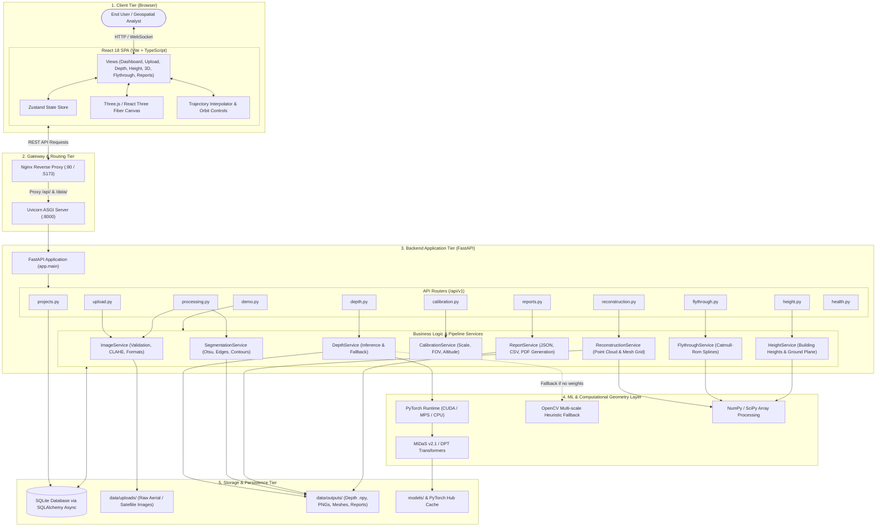
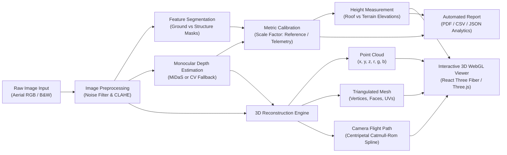
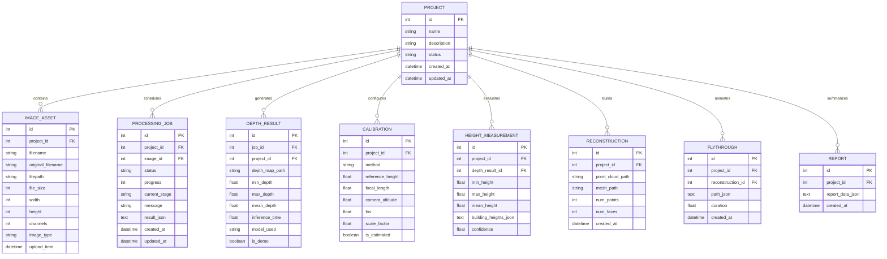
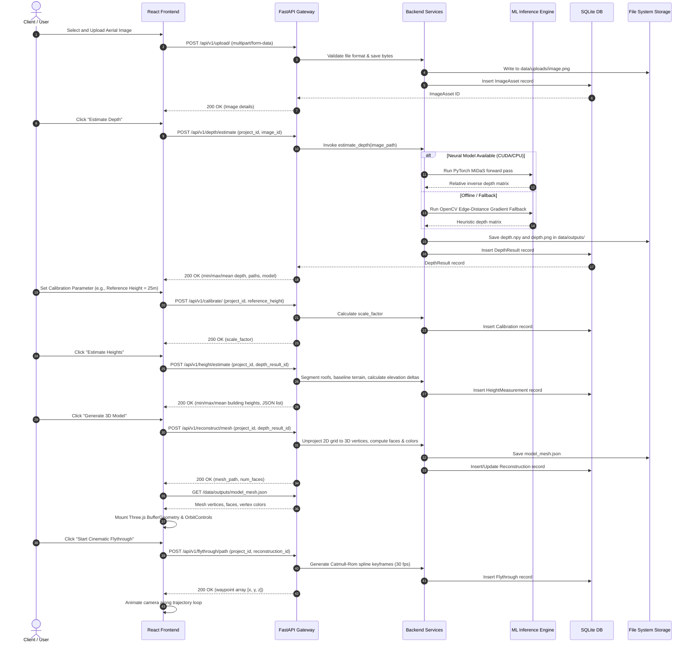

# System Architecture & Technical Design Document

## 1. Executive Summary

**DepthWizard** is a full-stack computer vision and 3D geospatial reconstruction platform built for **Smart India Hackathon (SIH) 2026 (Problem Statement ID: 26175)**. The platform converts single (monocular) aerial and satellite images into metric-calibrated 3D Digital Elevation Models (DEM), extracts structural and terrain elevations, generates dense point clouds and textured meshes, renders real-time 3D web graphics, and computes cinematic camera flythrough trajectories.

---

## 2. End-to-End System Architecture

The DepthWizard platform follows a decoupled, service-oriented architecture comprising four primary tiers:
1. **Client Tier**: Single Page Application (SPA) developed in React 18, TypeScript, and Tailwind CSS, utilizing Three.js and React Three Fiber for WebGL/WebGPU hardware-accelerated 3D scene rendering.
2. **API & Gateway Tier**: Asynchronous Python backend powered by FastAPI, Uvicorn, and Nginx reverse proxy, providing RESTful endpoints, static asset streaming, and validation.
3. **Processing & ML Inference Tier**: Monocular depth estimation engines combining PyTorch deep neural networks (Intel ISL MiDaS / DPT) with an offline computer vision edge-distance heuristic fallback, morphological segmentation, and metric calibration routines.
4. **Persistence & Storage Tier**: Relational metadata management via SQLite (SQLAlchemy 2.0 AsyncIO / aiosqlite) coupled with local filesystem storage for raw imagery, intermediate tensor arrays (`.npy`), 3D coordinate meshes (`.json`), and generated inspection reports.

---

## 3. Data Flow Architecture

The data pipeline progresses sequentially from raw image ingestion through preprocessing, monocular depth estimation, scale calibration, height extraction, 3D reconstruction, and visualization.

---

## 4. Component Diagram

```mermaid
graph TB
    subgraph FrontendComponents["Frontend Application Modules"]
        Nav["Navigation Bar & Route Switcher"]
        ProjMgr["Project Manager Component"]
        Uploader["File Dropzone & Upload Handler"]
        PreprocPanel["Preprocessing Control Panel"]
        DepthPanel["Depth Visualization with Colormap Selector"]
        HeightInspector["Building Height Bar Chart & Spatial Inspector"]
        Viewer3D["Three.js Viewport (Points, Mesh, Wireframe)"]
        SplineCtrl["Flythrough Trajectory Player Controls"]
        ReportViewer["Export & Analytics Dashboard"]
    end

    subgraph BackendComponents["Backend API Modules"]
        AuthMiddleware["CORS & Request Middleware"]
        UploadRouter["Upload Router (/upload)"]
        ProcessRouter["Processing Router (/preprocess, /segment)"]
        DepthRouter["Depth Router (/depth/estimate)"]
        CalibRouter["Calibration Router (/calibrate)"]
        HeightRouter["Height Router (/height/estimate)"]
        ReconRouter["Reconstruction Router (/reconstruct/...)"]
        FlyRouter["Flythrough Router (/flythrough/...)"]
        ReportRouter["Reports Router (/reports/...)"]
        HealthRouter["Health & Demo Router (/health, /demo)"]
    end

    subgraph ServiceLayer["Core Computational Services"]
        ImgProcSvc["Image Processing Service"]
        SegSvc["Segmentation Service"]
        DepthInferenceSvc["Depth Inference Service"]
        CalibEngine["Metric Calibration Engine"]
        HeightEngine["Height Estimation Engine"]
        MeshEngine["Point Cloud & Mesh Surface Engine"]
        SplineEngine["Catmull-Rom Spline Trajectory Engine"]
        ExportEngine["PDF/CSV/JSON Exporter"]
    end

    Uploader --> UploadRouter --> ImgProcSvc
    PreprocPanel --> ProcessRouter --> ImgProcSvc & SegSvc
    DepthPanel --> DepthRouter --> DepthInferenceSvc
    HeightInspector --> CalibRouter & HeightRouter --> CalibEngine & HeightEngine
    Viewer3D --> ReconRouter --> MeshEngine
    SplineCtrl --> FlyRouter --> SplineEngine
    ReportViewer --> ReportRouter --> ExportEngine
```

---

## 5. Database Schema Architecture

The relational database layer is managed using SQLAlchemy ORM with asynchronous execution via `aiosqlite`. It tracks projects, image assets, asynchronous processing jobs, depth results, metric calibrations, building height measurements, 3D reconstructions, flythrough trajectories, and reports.

---

## 6. API Sequence & Execution Lifecycle

The following sequence illustrates the chronological lifecycle of an end-user request through image ingestion, AI depth estimation, metric calibration, height measurement, 3D mesh building, and flythrough visualization.

---

## 7. Performance & Scalability Characteristics

1. **Memory Footprint**:
   - Monocular inference is executed with image tiling or constrained resolutions ($384 \times 384$ or $512 \times 512$) to ensure operation within $< 2\text{ GB}$ system RAM.
2. **Subsampling in 3D Meshing**:
   - Direct $1:1$ pixel-to-vertex meshing on a $2048 \times 2048$ image produces $> 4\text{ million}$ vertices, overwhelming browser WebGL buffers. DepthWizard implements adaptive regular grid downsampling (stride $= 4$ for point clouds, stride $= 8$ for polygonal surface meshes), producing lightweight, photorealistic geometries of $\sim 30,000 - 65,000$ triangles that achieve smooth 60 FPS in Three.js.
3. **Graceful Fallback Execution**:
   - Total resilience against absent GPUs or network cutoffs: If PyTorch CUDA models fail to initialize, the CV heuristic fallback executes instantly in $< 150\text{ ms}$ on standard x86 and ARM CPUs.
