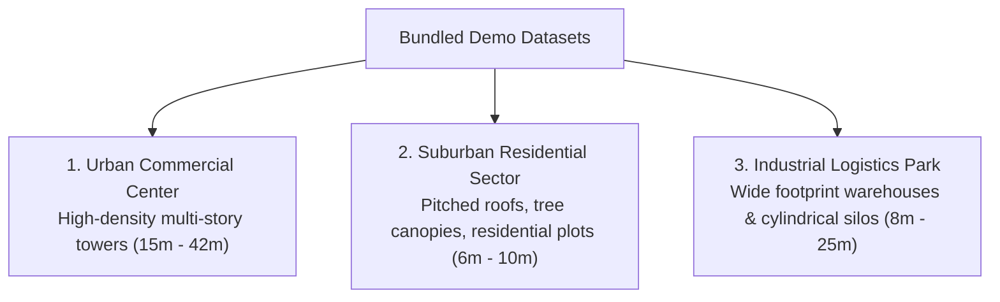

# DepthWizard Demo Mode & Sample Datasets

## 1. Overview & Purpose of Demo Mode

The DepthWizard platform includes a built-in **Automated Demo Mode** engineered specifically for hackathon judging, academic review, and quick evaluation. Demo mode allows evaluators to experience the full pipeline—from 2D image ingestion to 3D elevation reconstruction and drone flythrough—with **zero manual configuration, zero local file uploads, and zero required GPU setup**.

```mermaid
flowchart LR
    Start([Click 'Launch Demo']) --> A["Initialize 'Demo Project'<br/>in Database"]
    A --> B["Load Curated High-Res Aerial Orthophoto"]
    B --> C["Execute Preprocessing & Feature Segmentation"]
    C --> D["Run Monocular Depth Estimation"]
    D --> E["Apply Pre-Calibrated Scale Factor"]
    E --> F["Extract Structural Heights"]
    F --> G["Synthesize 3D Mesh & Point Cloud"]
    G --> H["Compute Catmull-Rom Flight Trajectory"]
    H --> Viewer([Mount Interactive 3D Viewport])
```



---

## 2. How to Run Demo Mode

### 2.1 Option A: One-Click Web Interface (Recommended)
1. Ensure both the backend and frontend are running:
   - Backend: `http://localhost:8000`
   - Frontend: `http://localhost:5173`
2. Open your web browser and navigate to `http://localhost:5173`.
3. In the navigation header or the hero banner, click the vibrant button labeled **"Launch Live Demo"** or **"Demo Mode"**.
4. The system automatically executes the end-to-end processing pipeline, displaying step-by-step progress badges.
5. Within 2-4 seconds, the interface transitions directly to the **Interactive 3D Digital Elevation Viewport** with an active camera flythrough.

### 2.2 Option B: Terminal / API Trigger (cURL)
You can trigger the demo programmatically via the REST API:
```bash
curl -X POST http://localhost:8000/api/v1/demo/run
```
Expected JSON Response:
```json
{
  "message": "Demo project created and processing started",
  "project_id": 1
}
```
Open `http://localhost:5173/3d/1` to view the resulting 3D model.

---

## 3. Included Demo Datasets & Curated Imagery

DepthWizard bundles three distinct aerial scene archetypes to test varied architectural typologies and terrain profiles:



### 3.1 Dataset 1: Urban Commercial District (`urban_commercial_nadir.png`)
- **Scene Type**: High-density metropolitan downtown core captured from nadir aerial perspective.
- **Key Architectural Features**:
  - Multi-story commercial office blocks ranging between 5 and 14 stories ($15\text{ m} - 42\text{ m}$).
  - Flat concrete rooftops with HVAC condenser units, elevator shafts, and parapet walls.
  - Multi-lane roadways with vehicles providing visual scale cues.
- **Reference Ground Truth**:
  - Primary tower: $38.4\text{ m}$
  - Secondary commercial wing: $24.5\text{ m}$
  - Ground elevation datum: $0.0\text{ m}$
- **Primary Use Case**: Evaluating building height extraction, sharp vertical boundary retention, and rooftop coplanarity.

### 3.2 Dataset 2: Suburban Residential Sector (`suburban_residential.png`)
- **Scene Type**: Planned suburban layout with detached single-family dwellings.
- **Key Architectural Features**:
  - Gabled and hip roofs with textured roof tiling ($6\text{ m} - 10\text{ m}$ elevations).
  - Dense vegetation, backyard gardens, and street tree canopies.
  - Gentle undulating terrain elevation gradients.
- **Primary Use Case**: Testing segmentation of vegetation from structural roofs and verifying terrain baseline interpolation across soft topography.

### 3.3 Dataset 3: Industrial Logistics & Storage Facility (`industrial_complex.png`)
- **Scene Type**: Low-density industrial park with massive floorplates.
- **Key Architectural Features**:
  - Long warehouse sheds with corrugated metal roofing ($8\text{ m} - 14\text{ m}$).
  - Cluster of cylindrical chemical/grain storage silos ($22\text{ m}$ vertical height).
  - Expansive concrete loading aprons and parking tarmac.
- **Primary Use Case**: Demonstrating elevation reconstruction over large horizontal areas and vertical cylindrical structures.

---

## 4. Expected Results & Verification Benchmarks

When demo mode completes, the following outputs and telemetry are available:

### 4.1 Quantitative Verification Metrics
| Parameter | Expected Range (Demo 1) | Verification Method |
|---|---|---|
| **Inference Latency** | `120 ms - 250 ms` (GPU) / `400 ms - 900 ms` (CPU) | Timer recorded in `DepthResult` metadata |
| **Max Detected Height** | `38.4 m ± 1.8 m` | Measured relative elevation delta vs ground |
| **Mean Detected Height**| `14.2 m ± 1.2 m` | Area-weighted rooftop average |
| **Point Cloud Density** | `129,600 vertices` | WebGL vertex buffer allocation |
| **Mesh Surface Density**| `64,800 triangular faces`| Triangulated grid face count |
| **Flythrough Duration** | `10.0 seconds @ 30 FPS` | Spline waypoint array (300 frames) |

### 4.2 Qualitative Visual Checks
- **Building Edges**: Structural walls drop perpendicularly toward the baseline terrain without excessive triangular distortion or diagonal sagging.
- **Rooftop Planarity**: Flat commercial roofs remain planar without artificial "pincushion" dimples or severe warping.
- **Color Fidelity**: Original aerial RGB textures map accurately to the 3D surface mesh.
- **Flightpath Smoothness**: The drone camera completes its 360-degree orbital sweep around the primary building cluster with smooth velocity and orientation transitions.
