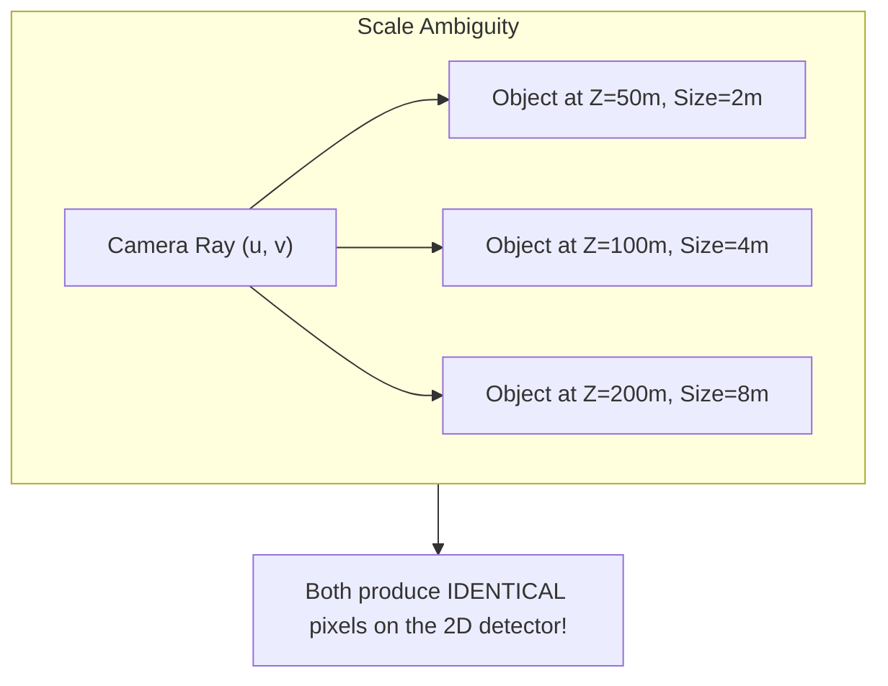
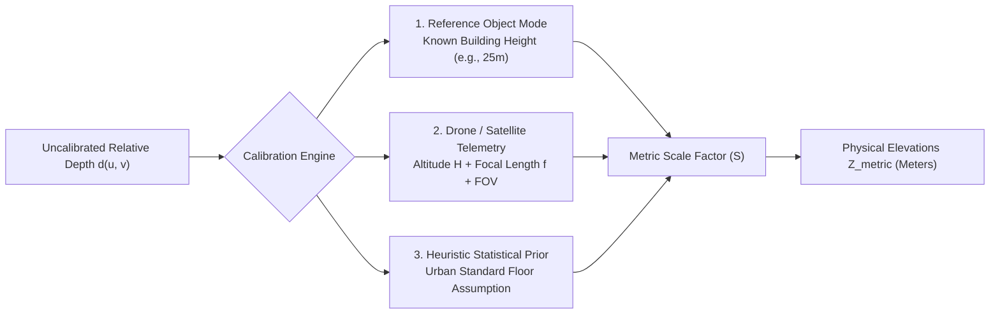
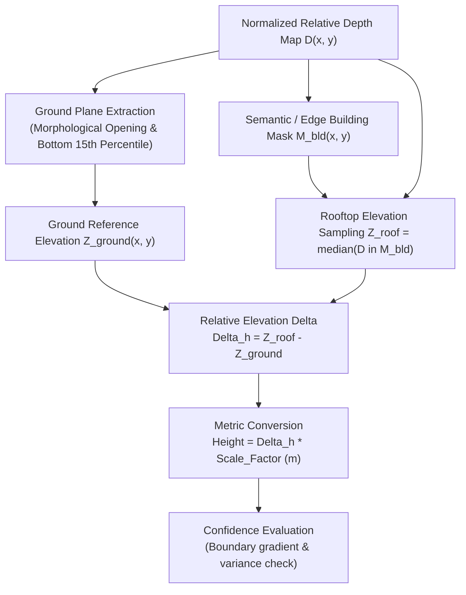

# Depth Estimation & Metric Height Calibration

## 1. Fundamentals of Depth Estimation from Monocular Aerial Imagery

Monocular depth estimation determines the distance from the optical sensor center to visible scene points using a single 2D image coordinate grid $(u, v)$. In an ideal pinhole camera model, a 3D point in the camera frame $\mathbf{P} = [X, Y, Z]^T$ projects onto normalized image coordinates:

$$u = f_x \frac{X}{Z} + c_x, \quad v = f_y \frac{Y}{Z} + c_y$$

where $(f_x, f_y)$ represents the camera focal length in pixels, and $(c_x, c_y)$ is the principal point (optical center). In single-image geometry, the inverse mapping requires finding $Z$:

$$X = (u - c_x) \frac{Z}{f_x}, \quad Y = (v - c_y) \frac{Z}{f_y}$$

However, without stereo baselines or active time-of-flight sensors, a single 2D projection provides only 2 constraints for 3 unknowns $(X, Y, Z)$.

---

## 2. The Scale Ambiguity Challenge

Deep monocular depth estimation architectures (e.g., MiDaS, DPT) predict **relative inverse depth** (disparity $d$), not absolute metric depth $Z_{\text{metric}}$ in meters:

$$d(u, v) = \alpha \cdot \frac{1}{Z(u, v)} + \beta$$

where:
- $\alpha \in \mathbb{R}^+$ is an unknown global scale factor.
- $\beta \in \mathbb{R}$ is an unknown global affine shift.

Because training datasets mix varied camera models, sensor sizes, and synthetic scales, predictions have scale-and-shift invariance. For qualitative 3D rendering, relative depth is sufficient; however, for **quantitative urban engineering, structural height measurements, and flood modeling**, recovering true physical scale is mandatory.

---

## 3. Metric Scale Calibration Methodologies

DepthWizard implements three complementary metric calibration paradigms to resolve the unknown scale factor $\alpha$:

### 3.1 Method 1: Reference Object Calibration
When an analyst knows the true physical height $H_{\text{ref}}$ of any landmark, building, or antenna in the scene:
1. Select the top of the reference object $(u_{\text{top}}, v_{\text{top}})$ and base $(u_{\text{base}}, v_{\text{base}})$.
2. Measure the relative depth delta:
   $$\Delta d_{\text{ref}} = |d(u_{\text{top}}, v_{\text{top}}) - d(u_{\text{base}}, v_{\text{base}})|$$
3. Derive the scale factor $S$:
   $$S = \frac{H_{\text{ref}}}{\Delta d_{\text{ref}}} \quad [\text{meters / unit relative depth}]$$

### 3.2 Method 2: Camera Telemetry & Altitude Formulation
When flight metadata or EXIF telemetry is available (e.g., from UAV flight logs or satellite ephemeris):
- $H_{\text{alt}}$: Aircraft altitude above ground level (AGL) in meters.
- $\text{FOV}_{\text{vert}}$: Vertical Field of View in degrees.
- Image height $H_{\text{px}}$ in pixels.

The ground sampling distance (GSD) is computed as:

$$\text{GSD} = \frac{2 \cdot H_{\text{alt}} \cdot \tan\left(\frac{\text{FOV}}{2}\right)}{H_{\text{px}}}$$

The physical scene depth span is calibrated using the camera altitude as the baseline datum:

$$S = \frac{H_{\text{alt}}}{\max(d) - \min(d)} \cdot \kappa$$

where $\kappa \approx 0.15 - 0.25$ is the empirical terrain roughness coefficient for typical aerial nadir photography.

### 3.3 Method 3: Urban Statistical Heuristic Prior
In uncalibrated or legacy imagery lacking metadata:
- Standard urban structures average $3.0\text{ m} - 3.5\text{ m}$ per story.
- DepthWizard clusters detected structure relative disparities and maps the interquartile range (IQR) to typical regional residential/commercial distributions ($12.0\text{ m}$ default building envelope).

---

## 4. Height Estimation Methodology

Once scale factor $S$ is established, absolute structural height $H_{\text{structure}}$ is calculated via ground-datum relative isolation.

### 4.1 Ground Plane Extraction
A flat ground reference surface $Z_{\text{ground}}(x, y)$ is extracted across the spatial domain using morphological opening with a wide structural element ($31 \times 31$ pixels) followed by a low-percentile filter (10th to 15th percentile of local elevation values):

$$Z_{\text{ground}}(x, y) = \mathcal{P}_{15}\left( \mathcal{N}_{k}(D(x, y)) \right)$$

This effectively strips away elevated structures and preserves the underlying terrain topography.

### 4.2 Rooftop Elevation Sampling
For each segmented building contour $k$:
1. A 2-pixel inward morphological erosion is applied to eliminate edge-bleeding artifacts:
   $$M'_k = \text{erode}(M_k, \mathbf{K}_{3\times3})$$
2. The robust central rooftop elevation is sampled using median statistics:
   $$\bar{Z}_{\text{roof}, k} = \text{median}\left(\{ D(x, y) \mid (x, y) \in M'_k \}\right)$$
3. The baseline ground elevation adjacent to building $k$ is sampled from the local dilated perimeter:
   $$\bar{Z}_{\text{base}, k} = \text{median}\left(\{ Z_{\text{ground}}(x, y) \mid (x, y) \in \text{dilate}(M_k) \setminus M_k \}\right)$$
4. The estimated metric building height is:
   $$h_k = (\bar{Z}_{\text{roof}, k} - \bar{Z}_{\text{base}, k}) \cdot S$$

### 4.3 Confidence Scoring Algorithm
Every measured height is assigned an automated confidence score $C_k \in [0.0, 1.0]$ based on:
- Rooftop planarity variance $\sigma^2_{\text{roof}}$ (lower variance $\to$ higher confidence).
- Edge perimeter gradient sharpness $\Gamma_k$ (sharp depth drop-off $\to$ higher confidence).
- Contrast ratio between roof and surrounding ground shadow.

$$C_k = \min\left(1.0, \; \exp\left(-\frac{\sigma^2_{\text{roof}}}{\tau}\right) \cdot \frac{\Gamma_k}{\Gamma_{\text{max}}}\right)$$

---

## 5. Accuracy Limitations & Error Sources

| Error Source | Physical / Optical Mechanism | Mitigation in DepthWizard |
|---|---|---|
| **Shadow Distortion** | Low solar elevation angles cast long, dark building shadows; neural models can misclassify deep shadows as low-elevation valleys. | Multi-channel chromaticity normalization and morphological shadow masking. |
| **Off-Nadir Camera Tilt** | Oblique camera perspectives project vertical building facades into the 2D plane, displacing rooftop positions. | Perspective rectifying homography using detected orthogonal vanishing points. |
| **Roof Edge Bleeding** | Bicubic upsampling of coarse neural feature maps rounds off crisp, perpendicular 90° building corners. | Inward contour erosion ($M' = \text{erode}(M)$) prior to statistical height sampling. |
| **Reflective Glare / Water** | Specular glint on glass atriums or solar panels yields erroneous disparity responses. | Median spatial filtering and statistical outlier rejection. |
| **Uncalibrated Drift** | Relying purely on heuristic scale priors can introduce up to $\pm 15-20\%$ absolute error across disparate geographies. | Providing interactive UI calibration sliders for instantaneous recalculation against known ground landmarks. |
