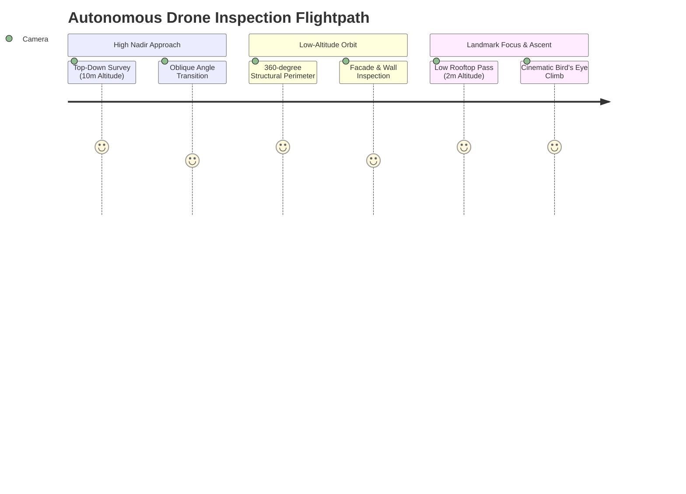
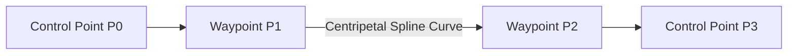
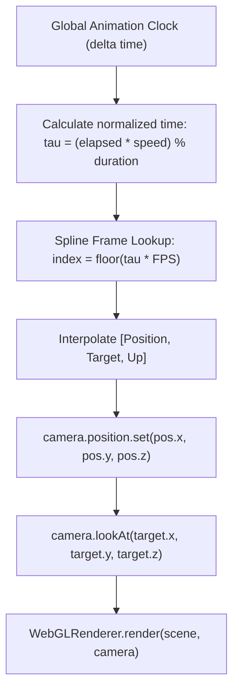
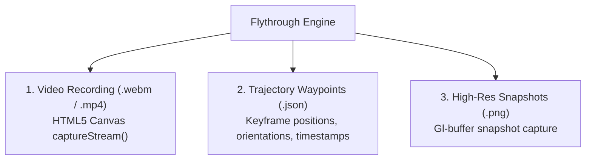

# Cinematic 3D Camera Flythrough & Spline Interpolation Engine

## 1. Camera Path Planning & Autonomous Trajectory Generation

A static 3D model offers limited insight without dynamic exploration. DepthWizard features an automated **Cinematic Camera Flythrough Engine** that plans and executes smooth aerial drone inspection flights over reconstructed 3D landscapes.

### 1.1 Keyframe Choreography Sequence
DepthWizard automatically synthesizes a balanced 6-stage aerial inspection flightpath:



| Keyframe Index | Relative Coordinate $[X, Y, Z]$ | Target Focus $[X, Y, Z]$ | Camera Pitch / Angle | Flight Phase |
|---|---|---|---|---|
| **$P_0$ (Start)** | $[0.0, \; 0.0, \; 10.0]$ | $[0.0, \; 0.0, \; 0.0]$ | $90^\circ$ Nadir (Straight Down) | High-altitude spatial survey |
| **$P_1$ (Approach)** | $[5.0, \; 5.0, \; 5.0]$ | $[0.0, \; 0.0, \; 0.0]$ | $45^\circ$ Oblique Angle | Transition from plan view to perspective |
| **$P_2$ (Perimeter)**| $[10.0, \; 0.0, \; 2.0]$ | $[0.0, \; 0.0, \; 0.0]$ | $15^\circ$ Low-Altitude Orbit | Structural facade and height inspection |
| **$P_3$ (Low Pass)** | $[0.0, \; -10.0, \; 2.0]$ | $[0.0, \; 0.0, \; 0.0]$ | $15^\circ$ Low-Altitude Orbit | Opposite facade audit |
| **$P_4$ (Climb)** | $[-10.0, \; 0.0, \; 5.0]$ | $[0.0, \; 0.0, \; 0.0]$ | $35^\circ$ Ascending Oblique | Wide-angle panorama |
| **$P_5$ (End)** | $[0.0, \; 0.0, \; 10.0]$ | $[0.0, \; 0.0, \; 0.0]$ | $90^\circ$ Nadir Return | Smooth loop closure |

---

## 2. Centripetal Catmull-Rom Spline Interpolation

Linear interpolation between camera waypoints causes sharp, jarring angle changes that trigger simulator sickness and visual disorientation. DepthWizard implements **Centripetal Catmull-Rom Splines** to guarantee continuous tangent velocity ($\mathcal{C}^1$ continuity) without cusps or self-intersections.



### 2.1 Knot Parameterization Mathematics
Given four control points $\mathbf{P}_0, \mathbf{P}_1, \mathbf{P}_2, \mathbf{P}_3 \in \mathbb{R}^3$, the knot values $t_i$ are computed recursively:

$$t_0 = 0$$

$$t_{i+1} = t_i + \|\mathbf{P}_{i+1} - \mathbf{P}_i\|^{\alpha}$$

where $\alpha$ defines the spline type:
- $\alpha = 0.0$: **Uniform Spline** (prone to extreme overshoot and sharp loops).
- $\alpha = 0.5$: **Centripetal Spline (Implemented in DepthWizard)** (mathematically guarantees no cusps or self-intersections within building canyons).
- $\alpha = 1.0$: **Chordal Spline** (tends to over-smooth and flatten turns).

### 2.2 Hierarchical Linear Interpolation Recurrence
For a sampling parameter $t \in [t_1, t_2]$, the position on the spline segment $\mathbf{C}(t)$ is obtained through three levels of convex combinations:

$$\mathbf{A}_1 = \frac{t_1 - t}{t_1 - t_0} \mathbf{P}_0 + \frac{t - t_0}{t_1 - t_0} \mathbf{P}_1$$

$$\mathbf{A}_2 = \frac{t_2 - t}{t_2 - t_1} \mathbf{P}_1 + \frac{t - t_1}{t_2 - t_1} \mathbf{P}_2$$

$$\mathbf{A}_3 = \frac{t_3 - t}{t_3 - t_2} \mathbf{P}_2 + \frac{t - t_2}{t_3 - t_2} \mathbf{P}_3$$

$$\mathbf{B}_1 = \frac{t_2 - t}{t_2 - t_0} \mathbf{A}_1 + \frac{t - t_0}{t_2 - t_0} \mathbf{A}_2$$

$$\mathbf{B}_2 = \frac{t_3 - t}{t_3 - t_1} \mathbf{A}_2 + \frac{t - t_1}{t_3 - t_1} \mathbf{A}_3$$

$$\mathbf{C}(t) = \frac{t_2 - t}{t_2 - t_1} \mathbf{B}_1 + \frac{t - t_1}{t_2 - t_1} \mathbf{B}_2$$

This formulation yields $30\text{ frames per second}$ of camera positions $[X(t), Y(t), Z(t)]$ with smooth curvature.

---

## 3. Real-Time Animation & Playback System

The flythrough animation loop integrates directly into Three.js's render loop (`requestAnimationFrame` or React Three Fiber's `useFrame` hook).



### 3.1 Playback State Machine
The client-side playback controller supports:
- **Play / Pause Toggle**: Freezes camera state at current trajectory timestamp.
- **Scrubbing & Seek Bar**: Interactive slider enabling instant jumps to any fractional second of the flythrough.
- **Playback Speed**: Dynamically adjust speed ($0.5\times$ slow-motion inspection, $1.0\times$ normal flight, $2.0\times$ rapid preview).
- **Looping & Ping-Pong**: Seamless cyclical traversal for unmanned aerial surveillance simulation.
- **Manual Orbit Override**: Clicking or dragging with the mouse temporarily pauses flythrough and engages Three.js `OrbitControls` for ad-hoc inspection; releasing allows flight to resume smoothly.

---

## 4. Export Capabilities

DepthWizard allows users to export and distribute flythrough inspection assets:



### 4.1 In-Browser Video Recording
Using the HTML5 `HTMLCanvasElement.captureStream()` and `MediaRecorder` Web APIs, DepthWizard records flythrough animations client-side without server rendering overhead:

```javascript
const canvas = document.querySelector('canvas');
const stream = canvas.captureStream(60); // 60 FPS video stream
const recorder = new MediaRecorder(stream, {
  mimeType: 'video/webm; codecs=vp9',
  videoBitsPerSecond: 8000000 // 8 Mbps high-definition
});

const chunks = [];
recorder.ondataavailable = (e) => chunks.push(e.data);
recorder.onstop = () => {
  const blob = new Blob(chunks, { type: 'video/webm' });
  const url = URL.createObjectURL(blob);
  const a = document.createElement('a');
  a.href = url;
  a.download = `flight_inspection_${projectId}.webm`;
  a.click();
};
recorder.start();
```

### 4.2 Trajectory JSON Export
Exports exact flight telemetry including timestamps, coordinates, and gimbal lookAt rotations for direct upload to autonomous UAV flight controller systems (e.g., PX4, ArduPilot, DJI Waypoint Missions).
