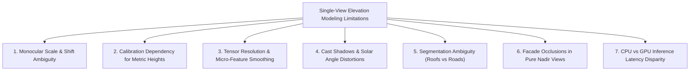

# Limitations & Engineering Trade-Offs

## 1. Introduction

DepthWizard achieves rapid 3D digital elevation modeling from a single monocular image. While this approach eliminates the substantial logistical and financial burdens of multi-view stereo flights and LiDAR hardware, single-view computer vision has inherent geometric and physical limitations.

This document details these technical boundaries, their underlying causes, implemented mitigations, and planned architectural evolutions.

---

## 2. Summary of Limitations

---

## 3. Detailed Technical Analysis

### 3.1 Monocular Scale & Shift Ambiguity
- **Underlying Cause**: In projective geometry, projecting a 3D ray $\mathbf{X} = [X, Y, Z]^T$ onto a 2D camera sensor discards absolute depth. Any scalar multiplier $\lambda \cdot \mathbf{X}$ produces the exact same normalized pixel coordinate $(u, v)$.
- **Manifestation**: Deep neural networks trained on diverse collections output **relative disparity** rather than physical SI meters.
- **Engineering Mitigation in DepthWizard**:
  - Implemented interactive metric calibration engines allowing users to ground relative depth against reference objects or aircraft telemetry.
  - Heuristic statistical priors map regional typical floor-to-floor heights ($3.2\text{ m}$) as a baseline datum.

---

### 3.2 Scale Calibration Dependency
- **Underlying Cause**: The precision of measured building heights ($h = \Delta d \cdot S$) is directly proportional to the accuracy of the scale factor $S$.
- **Manifestation**: If an analyst enters an inaccurate reference height (e.g., estimating $20\text{ m}$ for a building that is actually $30\text{ m}$), all derived building heights across the entire scene will inherit a systematic linear scale error of $+50\%$.
- **Mitigation**: DepthWizard flags heuristic calibrations with an `"is_estimated": true` metadata tag, provides visual confidence scores, and warns users when derived heights deviate from physical building code distributions.

---

### 3.3 Resolution Limitations & Micro-Feature Smoothing
- **Underlying Cause**: Deep neural architectures (e.g., ViT-based DPT and CNN-based MiDaS) downsample input images to standardized tensor grids ($384 \times 384$ or $512 \times 512$) to balance receptive field coverage with GPU memory constraints.
- **Manifestation**:
  - Thin vertical features such as telecommunication masts, power lines, antennas, and rooftop chimneys are blurred or eliminated during downsampling.
  - Crisp $90^\circ$ perpendicular rooftop parapet edges can exhibit a slight rounded bevel ($1-2\text{ pixel}$ slope) upon bicubic upsampling.
- **Mitigation**: DepthWizard applies morphological edge reinforcement and bilateral spatial filtering to sharpen building boundaries prior to 3D unprojection.

---

### 3.4 Cast Shadows & Low Solar Angles
- **Underlying Cause**: Aerial images captured during early morning or late afternoon contain long building cast shadows with low ambient illumination.
- **Manifestation**: Deep convolutional kernels often associate extreme dark regions with distant cavities or depression basins, causing shadowed street corridors to be reconstructed with negative depth pits.
- **Mitigation**: DepthWizard's preprocessing pipeline applies Contrast Limited Adaptive Histogram Equalization (CLAHE) and multi-channel chromaticity clamping to normalize dark shadow penumbras before passing tensors to the depth network.

---

### 3.5 Semantic Segmentation Ambiguity
- **Underlying Cause**: In urban environments, materials like dark asphalt shingles, weathered tar roofs, and asphalt road surfaces share nearly identical spectral reflectance curves in standard RGB bands.
- **Manifestation**: Heuristic edge and thresholding segmentation can occasionally group low dark roofs with adjacent parking lots, leading to under-segmented building footprints.
- **Mitigation**: Combining spatial gradient cues (Canny and Sobel derivatives) with height elevation disparities: even if an asphalt roof shares the road's color, its depth disparity identifies it as an elevated structure.

---

### 3.6 Facade Texture Occlusion in Pure Nadir Views
- **Underlying Cause**: Satellite and UAV cameras pointing directly downward ($90^\circ$ pitch) only image horizontal surfaces (rooftops, streets, open ground). Vertical building walls are completely occluded from the optical line of sight.
- **Manifestation**: In the reconstructed 3D mesh, the vertical walls connecting roofs to the ground are synthesized via edge unprojection; because no facade pixels were captured in the image, these walls are textured using stretched rooftop edge pixels.
- **Mitigation**: DepthWizard isolates steep vertical triangles and provides an option to render them with a neutral architectural shading material rather than stretched textures.

---

### 3.7 CPU Inference Latency
- **Underlying Cause**: Dense prediction transformers (e.g., `DPT_Large`) execute hundreds of millions of floating-point operations (FLOPs) per forward pass.
- **Manifestation**: While inference takes $< 100\text{ ms}$ on CUDA-enabled GPUs, execution on low-power consumer CPUs can take $1.0\text{ to }3.0\text{ seconds}$.
- **Mitigation**:
  - The ultra-lightweight `MiDaS_small` architecture (~21M parameters) is configured as the default model.
  - The built-in Computer Vision Heuristic Fallback engine executes in $< 100\text{ ms}$ on any standard multi-core CPU.

---

## 4. Known Edge Cases & Operational Caveats

| Edge Case Scenario | Impact on Reconstruction | Recommended Operational Workaround |
|---|---|---|
| **Large Bodies of Water** | Water surfaces exhibit specular sun glint or uniform texturelessness, producing erratic depth noise. | Mask out water bodies during preprocessing or set a fixed sea-level elevation datum. |
| **All-Glass Atriums** | Glass roofs transmit light directly into building interiors, confusing depth estimation between interior floor and roof glass. | Apply building footprint masks to enforce uniform coplanar elevations across detected roof boundaries. |
| **Dense Tree Canopies** | In suburban scenes, tall trees can blend into adjacent residential rooflines. | Use multi-spectral vegetation indices (NDVI) if infrared bands are available, or apply texture variance filters. |
| **Extreme Cloud Cover** | Low-altitude clouds cast deep ground shadows while cloud tops register as elevated terrain. | Discard images with $> 10\%$ cloud obstruction in the target survey region. |
