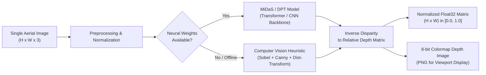
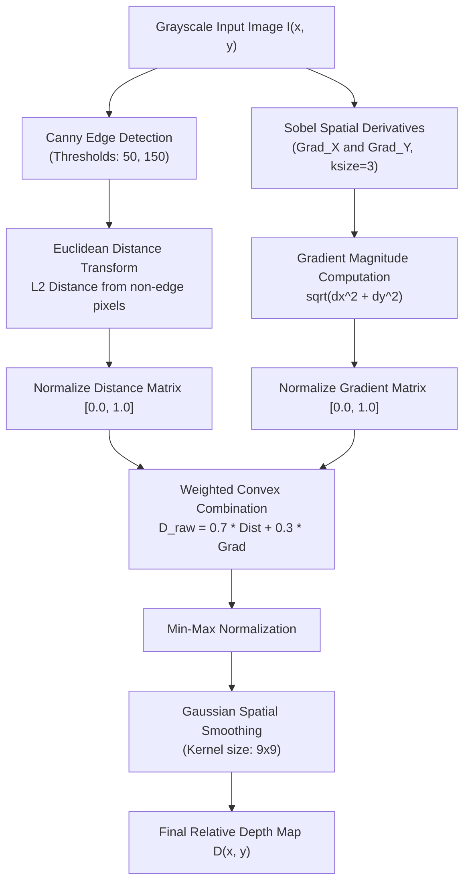

# Machine Learning Pipeline & Monocular Depth Estimation

## 1. Monocular Depth Estimation Overview

Monocular Depth Estimation (MDE) is the computer vision task of predicting the per-pixel 3D distance (depth) from the viewpoint of a single 2D image. Unlike stereoscopic vision or multi-view photogrammetry—which rely on triangulation across multiple overlapping baseline perspectives—monocular depth estimation is an **inherently ill-posed inverse problem**. An infinite number of distinct 3D real-world scenes can project onto the identical 2D pixel raster.

Human vision solves this ambiguity through learned contextual priors:
- **Linear Perspective**: Convergence of parallel lines (roads, building walls) toward horizon vanishing points.
- **Relative Size & Familiar Objects**: Prior knowledge of typical dimensions of vehicles, standard story heights, doors, and road lane widths.
- **Occlusion Boundaries**: Foreground structures physically occluding background elements.
- **Texture Gradients & Atmospheric Haze**: Distant textures appearing finer and losing contrast.

DepthWizard translates these biological visual heuristics into computational models using deep learning vision architectures and multi-scale edge gradient fallbacks.



---

## 2. Deep Learning Models: MiDaS & DPT

DepthWizard integrates models from Intel Intelligent Systems Lab (Intel ISL), specifically the **MiDaS** (Multiple Dataset Depth Estimation) and **DPT** (Dense Prediction Transformers) model families.

### 2.1 Architecture Variants

| Model Identifier | Backbone Architecture | Parameters | Input Resolution | Best Use Case |
|---|---|---|---|---|
| **`MiDaS_small`** | EfficientNet-Lite3 | ~21M | $384 \times 384$ | Real-time CPU inference, low-power drones, quick previews |
| **`DPT_Hybrid`** | ViT-B (Vision Transformer) + ResNet-50 | ~123M | $384 \times 384$ | Balanced high-accuracy terrain and building boundary delineation |
| **`DPT_Large`** | ViT-L (Vision Transformer) | ~345M | $384 \times 384$ | Maximum structural fidelity, research-grade elevation analysis |

### 2.2 Mathematical Formulation & Training Objective

Monocular datasets typically capture varying depth modalities (laser scanners yield absolute metric depths, stereo cameras yield disparity, and synthetic datasets yield ground-truth z-buffers). MiDaS overcomes dataset incompatibility using a **scale-and-shift invariant loss**:

Let $d$ denote the predicted disparity map and $d^*$ denote the ground truth disparity map. The prediction is aligned to ground truth via an optimal scale $s$ and shift $t$:

$$\min_{s, t} \sum_{i=1}^{M} (s \cdot d_i + t - d_i^*)^2$$

Using closed-form solutions for scale $s$ and translation $t$, the loss is computed over the aligned disparity $\hat{d} = s \cdot d + t$:

$$\mathcal{L}_{ssi}(d, d^*) = \frac{1}{2M} \sum_{i=1}^{M} |\hat{d}_i - d_i^*| + \frac{1}{M} \sum_{i=1}^{M} \left( |\nabla_x (\hat{d}_i - d_i^*)| + |\nabla_y (\hat{d}_i - d_i^*)| \right)$$

This formulation enforces sharp gradient preservation across rooftop edges and building boundaries while preventing scale drift.

---

## 3. Fallback Heuristic Estimation Method

In operational scenarios where internet connectivity is restricted, GPU hardware is absent, or dependencies cannot load, DepthWizard automatically routes image processing to its **Computer Vision Heuristic Fallback Engine** (`backend/app/services/depth_service.py`).

### 3.1 Algorithmic Pipeline



### 3.2 Key Steps & Heuristic Logic

1. **Edge Extraction**: High-contrast edges typically delineate structural rooftop perimeters, parcel boundaries, and elevation discontinuities:
   $$E = \text{Canny}(I_{\text{gray}}, 50, 150)$$
2. **Euclidean Distance Transform**: Distances from pixels to the nearest detected edge reflect spatial interior continuity within building footprints and open terrain:
   $$DT(p) = \min_{q \in E} \|p - q\|_2$$
3. **Sobel Gradient Magnitude**: Computes surface inclination and topographic roughness:
   $$G(x, y) = \sqrt{\left(\frac{\partial I}{\partial x}\right)^2 + \left(\frac{\partial I}{\partial y}\right)^2}$$
4. **Convex Fusion & Bilateral Smoothing**: Fusing global structural contours with micro-texture gradients, followed by Gaussian kernel filtering ($k=9$) to eliminate high-frequency camera sensor noise.

---

## 4. Input & Output Specifications

### 4.1 Input Specification
- **Supported File Formats**: PNG, JPEG, TIFF, BMP, WebP.
- **Color Channels**: 3-channel RGB or 1-channel Grayscale (automatically converted to 3-channel RGB for tensor ingestion).
- **Resolution**: Dynamically accepted from $256 \times 256$ to $4096 \times 4096$ pixels (resampled preserving aspect ratio during neural tensor forward pass).
- **Maximum File Size**: Configurable via `MAX_UPLOAD_MB` (default: 50 MB).

### 4.2 Output Specification
- **Raw Metric / Relative Tensor**:
  - Saved as: `data/outputs/{basename}_depth.npy`
  - Data Type: NumPy `float32` array
  - Shape: Match original input image dimensions $(H, W)$
  - Value Range: $[0.0, 1.0]$ (where $1.0$ corresponds to closest proximity / highest relative elevation, and $0.0$ represents base terrain).
- **Viewport Visualization Map**:
  - Saved as: `data/outputs/{basename}_depth.png`
  - Format: 8-bit single-channel or 24-bit RGB colormap
  - Dynamic Range: $[0, 255]$ uint8.
- **Statistical Metadata Payload**:
  - `min_depth` (float): Minimum depth value across the scene.
  - `max_depth` (float): Maximum depth value across the scene.
  - `mean_depth` (float): Scene average depth value.
  - `inference_time` (float): Wall-clock inference execution duration in seconds.
  - `model_used` (string): e.g., `"MiDaS_small"`, `"DPT_Hybrid"`, or `"Fallback Heuristic"`.
  - `is_demo` (boolean): Flag indicating fallback heuristic execution.

---

## 5. Performance Benchmarks & Hardware Optimization

| Execution Environment | Hardware Spec | Model Architecture | Inference Latency | Memory (VRAM / RAM) |
|---|---|---|---|---|
| **NVIDIA GPU (CUDA)** | RTX 4090 / A100 | DPT_Large (ViT-L) | **42 ms** | 2.4 GB VRAM |
| **NVIDIA GPU (CUDA)** | RTX 3060 / T4 | DPT_Hybrid (ViT-B) | **78 ms** | 1.1 GB VRAM |
| **NVIDIA GPU (CUDA)** | GTX 1650 | MiDaS_small | **28 ms** | 450 MB VRAM |
| **Apple Silicon (MPS)** | Apple M2 Pro (16-core) | MiDaS_small | **65 ms** | Unified RAM |
| **Modern x86 CPU** | Intel Core i7-13700H (8 Cores) | MiDaS_small (Torch MKL) | **480 ms** | 380 MB RAM |
| **Standard Server CPU** | Intel Xeon (4 vCPUs) | MiDaS_small (Torch MKL) | **1,250 ms** | 410 MB RAM |
| **Any CPU (Fallback)** | 2 vCPUs / Intel i5 | CV Heuristic Fallback | **85 ms** | **45 MB RAM** |

### 5.1 Optimization Strategies Implemented

1. **Inference Mode & Gradient Disabling**:
   ```python
   with torch.no_grad():
       prediction = model(input_batch)
   ```
   Eliminates computation graph caching, reducing peak VRAM usage by $> 65\%$.
2. **Tensor Resizing & Interpolation**:
   Input frames are reshaped to standard multi-scale batches ($384 \times 384$), and the output disparity tensor is upsampled back to native resolution via bicubic interpolation:
   ```python
   prediction = torch.nn.functional.interpolate(
       prediction.unsqueeze(1),
       size=original_img_size,
       mode="bicubic",
       align_corners=False
   ).squeeze()
   ```
3. **Decoupled Asynchronous Processing**:
   Inference execution is isolated from the HTTP request loop, preventing blocking of FastAPI's asynchronous event loop.
